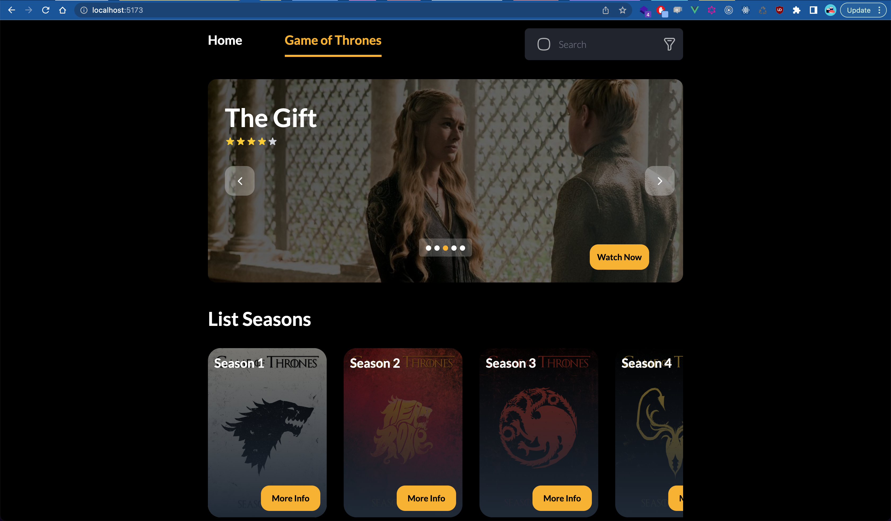
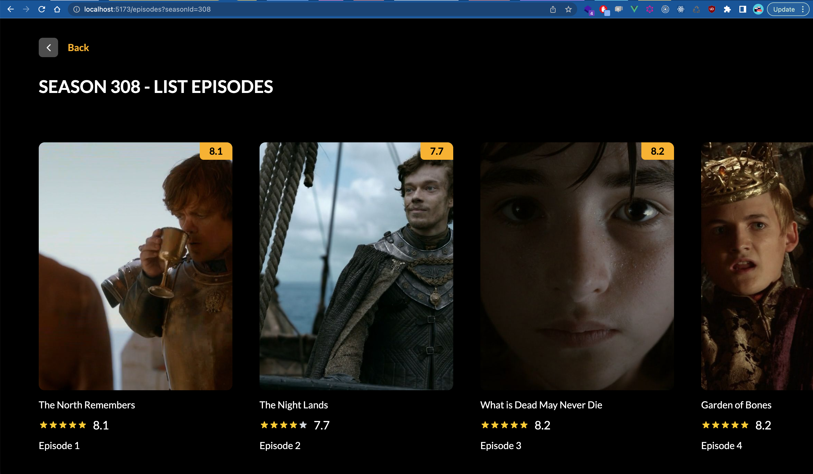
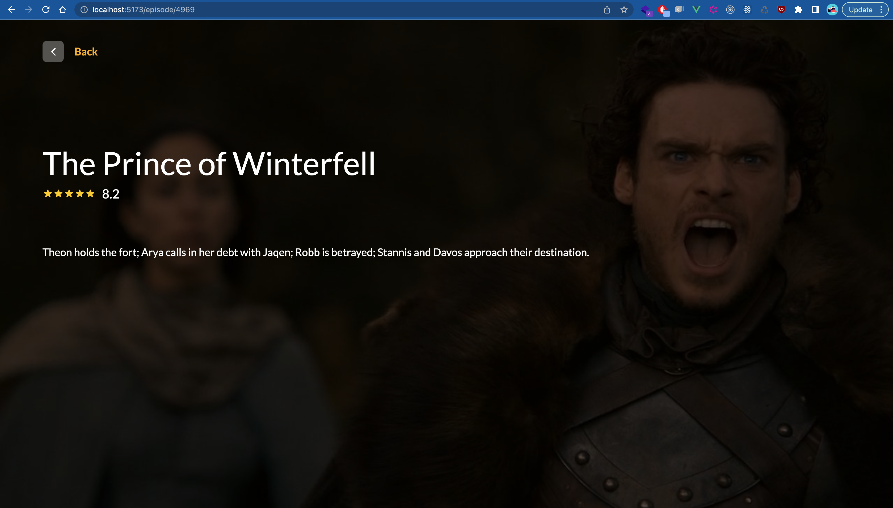

# Frontend Engineer Test at Indochat (PT. ICE Messenger Indonesia)

Hello, My name is Fathan Rohman I am Frontend engineer. I create sample fetch Data from api/tvmaze.com site. Please code review my codebase for IT Manager, Tech Lead Frontend on Tech Department Indochat.

## Tools Used

```sh
- Visual Studio Code v1.77.3
- Git
- Iterm
- Web Browser (Google Chrome, Mozilla, Safari, Edge)
```
## Stack Technology

```sh
- Node.js v18.12.1
- Vue.js v.3
- Vite
- Pinia for State management
- TailwindCSS
```

## Devendencies List

```sh
"dependencies": {
  "axios": "^1.4.0",
  "pinia": "^2.0.36",
  "swiper": "^9.3.2",
  "v-lazy-image": "^2.1.1",
  "vue": "^3.3.2",
  "vue-router": "^4.2.0"
},
"devDependencies": {
  "@rushstack/eslint-patch": "^1.2.0",
  "@vitejs/plugin-vue": "^4.2.3",
  "@vue/eslint-config-prettier": "^7.1.0",
  "@vue/test-utils": "^2.3.2",
  "autoprefixer": "^10.4.14",
  "cypress": "^12.12.0",
  "eslint": "^8.39.0",
  "eslint-plugin-cypress": "^2.13.3",
  "eslint-plugin-vue": "^9.11.0",
  "jsdom": "^22.0.0",
  "mitt": "^3.0.0",
  "prettier": "^2.8.8",
  "sass": "^1.63.3",
  "start-server-and-test": "^2.0.0",
  "tailwindcss": "^3.3.2",
  "vite": "^4.3.5",
  "vitest": "^0.31.0"
}
```

## Result Screenshot Project 

Homepage


Episode List


Episode Detail

--------------


## Recommended IDE Setup

[VSCode](https://code.visualstudio.com/) + [Volar](https://marketplace.visualstudio.com/items?itemName=Vue.volar) (and disable Vetur) + [TypeScript Vue Plugin (Volar)](https://marketplace.visualstudio.com/items?itemName=Vue.vscode-typescript-vue-plugin).

## Customize configuration

See [Vite Configuration Reference](https://vitejs.dev/config/).

## Project Setup

```sh
npm install
```

### Compile and Hot-Reload for Development

```sh
npm run dev
```

### Compile and Minify for Production

```sh
npm run build
```

### Run Unit Tests with [Vitest](https://vitest.dev/)

```sh
npm run test:unit
```

### Run End-to-End Tests with [Cypress](https://www.cypress.io/)

```sh
npm run test:e2e:dev
```

This runs the end-to-end tests against the Vite development server.
It is much faster than the production build.

But it's still recommended to test the production build with `test:e2e` before deploying (e.g. in CI environments):

```sh
npm run build
npm run test:e2e
```

### Lint with [ESLint](https://eslint.org/)

```sh
npm run lint
```

## @TODO
```
- Unit Test
```